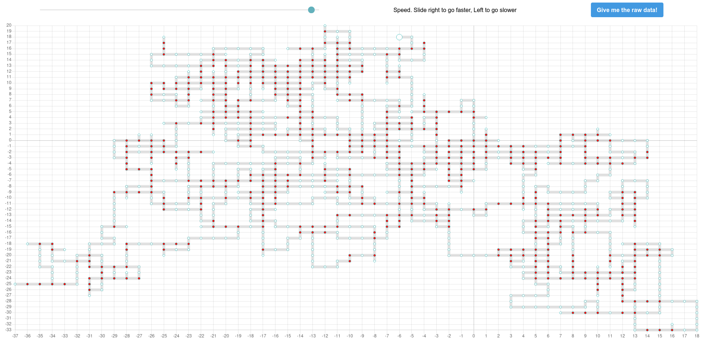

## How to interpret the graph:

- The end location of the turtle is the biggest dot on the chart
- The points which the turtle has visited more than once are red. Other points are white



## How to run it

### Using docker-compose

```
docker-compose up
```

### Manually

Make sure you have these installed:

- yarn
- python 3.8 (3.7 will probably work too)
- pipenv

Then run

```
cd turtle-frontend
yarn
yarn start

cd turtle-backend
pipenv sync
pipenv run python main.py
```

Then, go to http://localhost:3000 in your favourite browser and upload one of the .txt files in the data/ folder.
Make sure ports 3000 and 8000 are not in use by another application on the computer you're running this on, or change docker-compose.yml as needed.

# AltaML Interview Coding Exercise

In this repo, there is a compressed file with a number of text files. Inside the text files, you will see characters such as LLRFLFLF. Imagine you're a turtle starting at 0,0 that needs to follow the directions in the text file. Each letter represents a movement, L means the turtle turns counterclockwise, R means the turtle turns clockwise, and F means forward. Note, turning the turtle only changes the turtle's orientation.

Write an App that takes in a text file like the one provided that displays in a visual manner the path the turtle travels and highlights the locations where the turtle crosses his own path. You can be creative as you would like with the interface but it must show in a visual manner the following: 1) The end location of the turtle, 2) The full path that that turtle travelled and 3) all of the points where the turtle has traveled to more than once ("FFFLFFLLF" would, for example return: (-1,3))

The application's front end can be written using any framework/language you see fit but any backend work needs to be written using Python. Unit tests are encouraged but not required. When you have it complete please add it to your github and send us a link. The more user friendly the UI the better.

Reach out if you have any clarifying questions. We look forward to seeing what you come up with.
